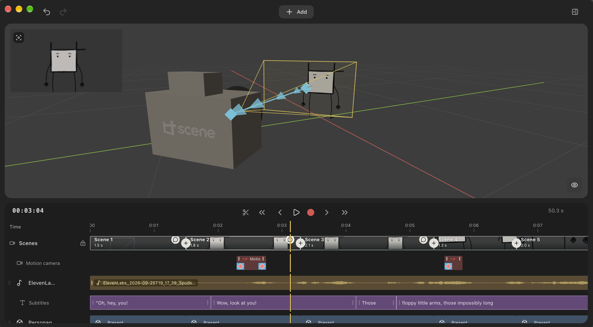

<p align="center">
  
</p>

# Scene

**Scene is a simple, local desktop editor designed to save time when creating 3D storyboards and animatics.**

Blender is extremely powerful, but its broad feature set also introduces a steep learning curve and a great deal of setup for people who only need to plan a video. Scene removes that overhead and keeps the workflow focused on the essentials: composing shots, arranging 3D objects and 2D layers, defining camera movement and timing, adding audio, and writing precise production notes. The result is a structured, editable project that can be exported to Blender and used as input for an AI coding agent.

<p align="center">
  
</p>

## Why Scene exists

Recent AI models have become very capable at creating, modifying, and organizing 3D content. At the same time, ABACO needed a more consistent way to produce educational animated content for its social channels.

These two needs led to **Scene**: a tool designed to turn an idea into a 3D storyboard without requiring specialist skills. Its primary goal is to make storyboarding faster and less tiring. Blender can do far more, but learning and navigating features that are not needed during previsualization can make a simple storyboard unnecessarily slow to produce. Scene reduces the number of tools and decisions involved, so users can concentrate on the sequence, composition, timing, and instructions.

Scene is not intended to replace Blender or professional animation software. It provides a focused starting point for the early planning stage, while keeping the project ready for more advanced work later.

A project created with Scene can be opened directly in Blender or passed to a preferred coding agent—such as Codex, Claude Code, or Cursor—together with detailed instructions for extending, automating, or refining the 3D scene.

Scene is still an early-stage project and is intentionally focused. It was created for ABACO's social-media production workflow and will evolve as new practical needs emerge. The code is available to anyone facing a similar challenge who wants to adapt it, extend it, or integrate additional services, APIs, and automations.

## Features

- organize multiple scenes on a continuous timeline;
- add 3D primitives, Blender files, images, and 2D text;
- define shots, camera positions, and motion using timeline control points;
- attach production notes to scenes, movements, and individual elements;
- import audio tracks, display their waveforms, and adjust volume;
- preview the animatic directly in the editor;
- export versioned Blender projects and a separate WAV audio track;
- save portable projects with their assets collected alongside the scene data.

## Workflow

1. Create the scenes and set their duration.
2. Add the required elements and compose each shot.
3. Record or edit camera and object motion on the timeline.
4. Add production notes and audio tracks.
5. Save the project and export the `.blend` file.
6. Continue manually in Blender, or pass the project and its instructions to an AI agent for more advanced work.

Projects are saved as `scene.abaco.json`. Exports are created next to the project in incrementally versioned folders (`exports/v001`, `v002`, and so on), so previous versions are never overwritten.

## Architecture

Scene is a desktop application built with Electron, React, and Three.js. Project data is validated with Zod, while Blender exports are generated by a deterministic local Python script.

The application can compose scenes and export projects without an API key. AI integration is optional: when enabled, the OpenAI API key is encrypted with Electron's `safeStorage` and is never included in project files.

Plans produced by the model are validated before they are applied. The model cannot provide arbitrary Python code, select local filesystem paths, or directly delete project elements.

## Development

Requirements:

- Node.js 22 or later;
- npm;
- Blender.

On macOS, Scene automatically looks for Blender in `/Applications/Blender.app`. On Linux, it detects the `org.blender.Blender` Flatpak. A different executable can be selected in the application settings.

```bash
npm install
npm run dev
```

## Testing and packaging

```bash
npm test
npm run build
npm run package:linux
npm run package:mac
```

Packages are generated in `release/`: AppImage for Linux and ZIP for Apple Silicon Macs.

## Project status

Scene is experimental and under active development. Its current feature set is intentionally small and focused on ABACO's internal workflow. Bug reports, adaptations, and integrations are welcome, provided they preserve an experience that remains simple and understandable for people who do not regularly work with 3D software.
